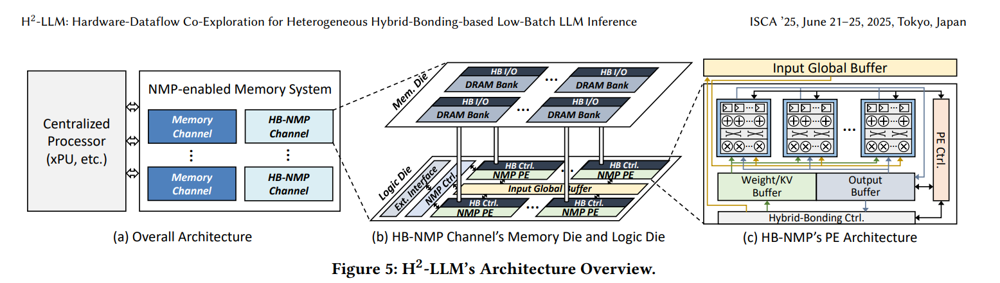
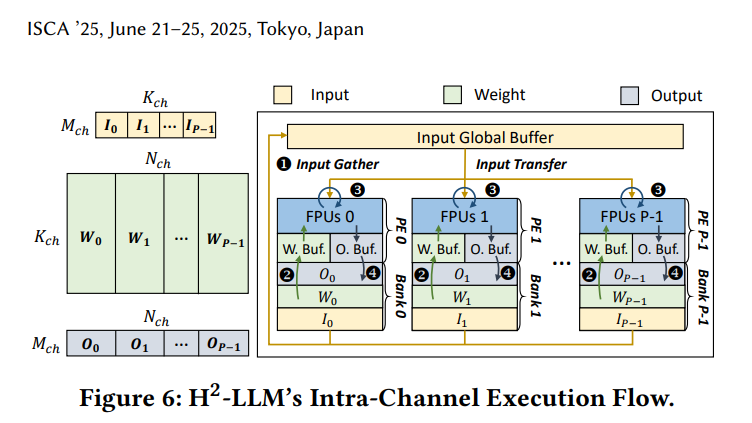
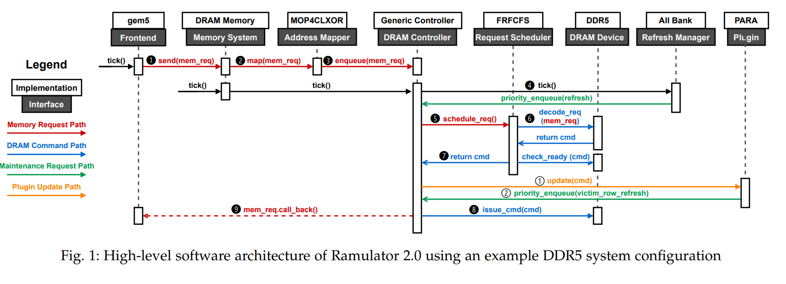
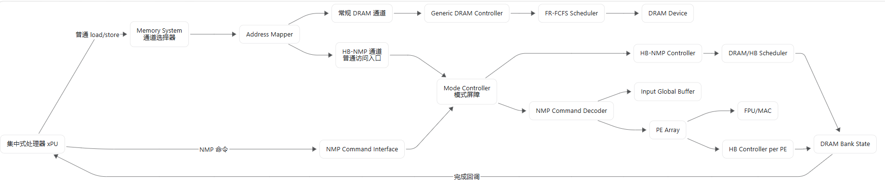
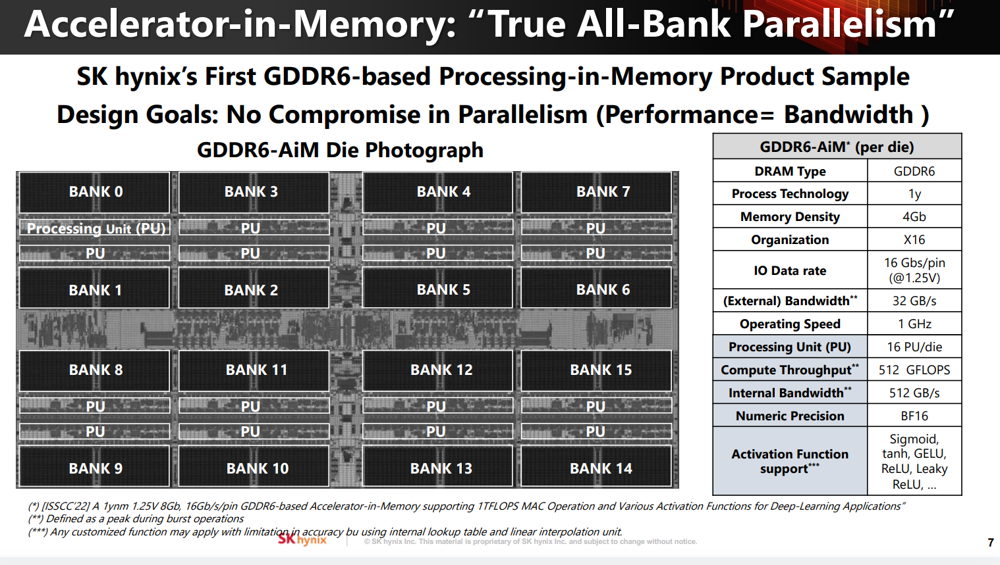
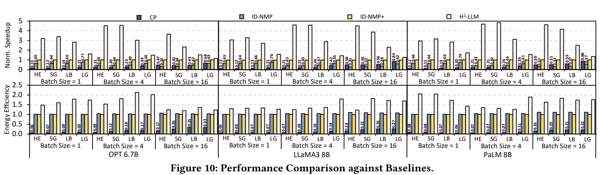

Ramulator2指令流如图

H2LLM应该是在Address Mapper上做了两条互斥的路径，也就是论文里说的NMP模式和常规DRAM模式

论文里的baseline应该是三种情况，一种是仅集中处理器xPU
一种是三星的架构，参数是每个bank一个PE，具有 6.4 GB/s 的 NMP 带宽，并配备一个包含 16 个 MAC、运行于 200 MHz 的 FPU。每个通道的 NMP 计算能力和带宽分别为 102.4 GFLOPS 和 102.4 GB/s。
另一种是海力士AiM设计，和三星的区别是FPU的频率是1GHz

论文里CP，ID-NMP，ID-NMP+对应这三种

