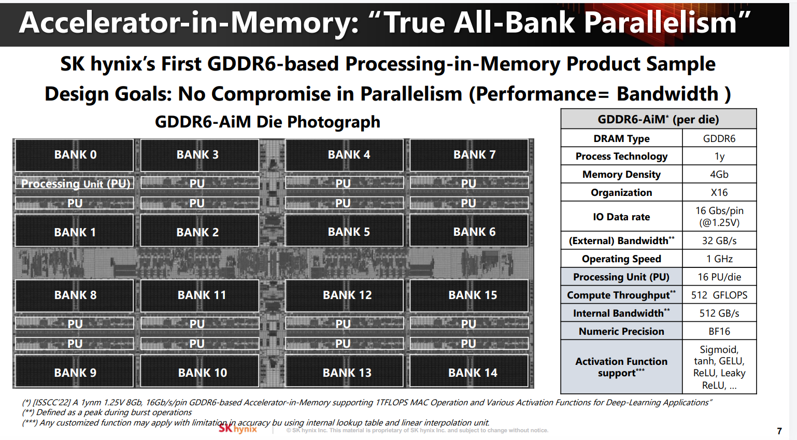
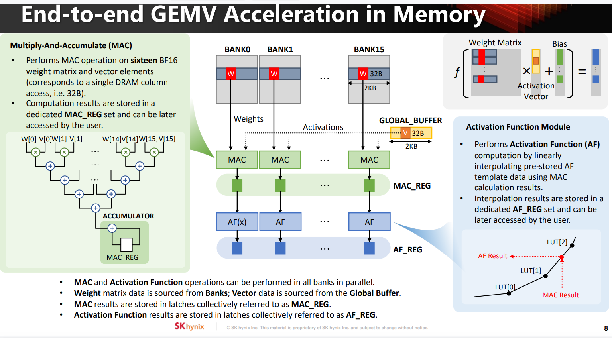
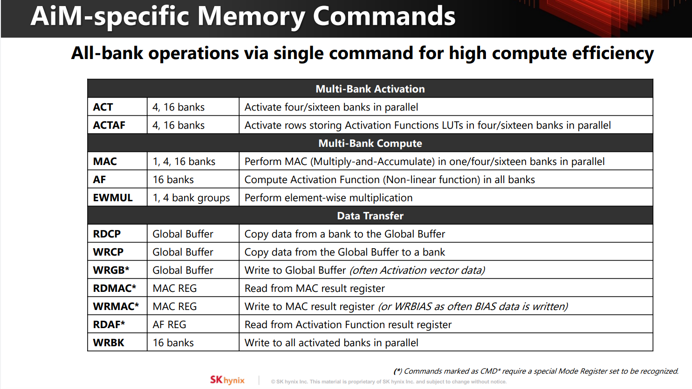
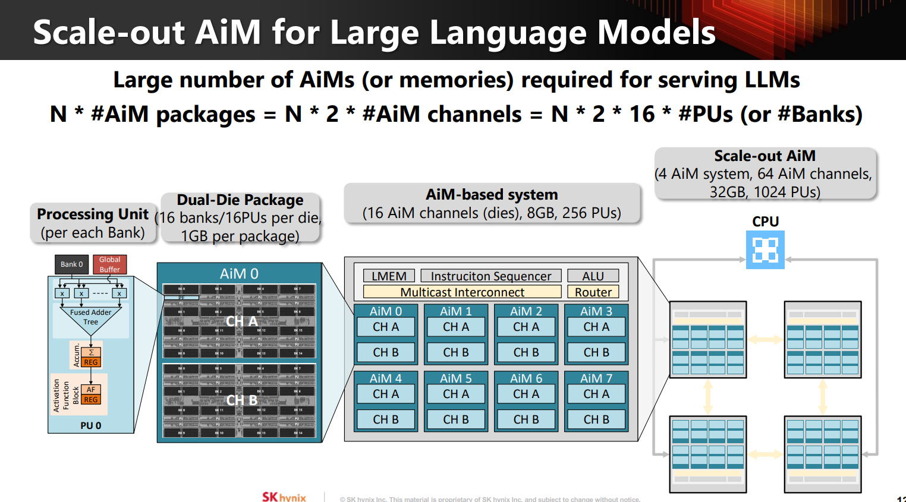
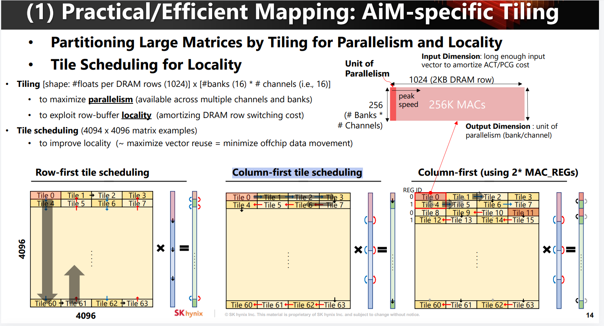
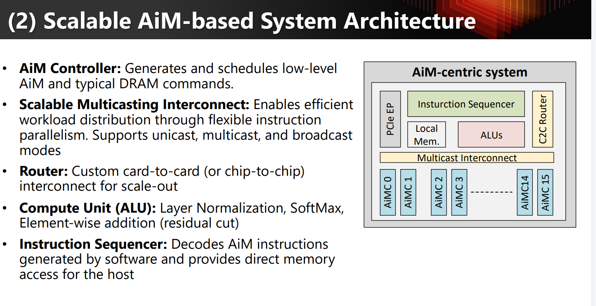

## 引用41：Memory-Centric Computing with SK hynix’s Domain-Specific Memory
SK hynix 第一代基于 GDDR6 的 AiM/PIM 样片

内存类型：GDDR6
工艺：1y
容量密度：4Gb
数据组织：X16(16bit位宽)
I/O 速率：16Gbps/pin，1.25V（16位宽*16Gbps=32GBps）
外部带宽：32GB/s
工作频率：1GHz
每颗 Die：16 个 Bank
16 个 Processing Unit（PU）
峰值计算吞吐：512 GFLOPS
内部带宽：512GB/s
数值格式：BF16
支持激活函数：Sigmoid、tanh、GELU、ReLU、Leaky ReLU 等

GEMV架构

每次读取32B数据，对应16个BF16，做MAC
每个bank有2KB数据宽
激活函数：查表+线性激活

AiM内存指令：

多 Bank 激活
- ACT：同时激活 4 或 16 个 Bank；
- ACTAF：同时激活存放激活函数查找表的 Bank。

多 Bank 计算
- MAC：执行乘加，可在 1、4 或 16 个 Bank 中并行执行；
- AF：在所有 Bank 中计算激活函数；
- EWMUL：执行逐元素乘法。

数据传输
- RDCP：把 Bank 数据复制到 Global Buffer；
- WRCP：把 Global Buffer 数据写回 Bank；
- WRGB：写入 Global Buffer，通常用于输入激活向量；
- RDMAC / WRMAC：读取或写入 MAC 结果寄存器；
- RDAF：读取激活函数结果；
- WRBK：同时向所有已激活 Bank 写数据。

Scale-out横向扩展

1 个 Die：
16 个 Bank、16 个 PU、4Gb = 0.5GB

1 个 Dual-Die Package：
2 个 Die
= 1GB
= 32 个 Bank
= 32 个 PU

16 个 AiM channels（也就是 16 个 Die）
8GB
256 个 PU

4 个 AiM system
= 64 个 AiM channels
= 32GB
= 1024 个 PU

高效scaling的方法：
- tiling
- 用 AiM Controller、Instruction Sequencer、Multicast Interconnect 和 Router把AiM封装协同工作
- 矩阵-向量累加指令（Matrix-Vector Accumulate）：软件发出一条高层指令，硬件自动拆分并广播到多个 AiM 通道

### Tiling

tile：
- row方向大小：bank*channel数，用于并行计算
- column方向大小：DRAMrow大小（2KB），用于复用数据

三种scheduling

###  Scalable AiM-based System Architecture

AiM Controller
生成和调度 AiM 专用指令以及普通 DRAM 指令；
把上层计算任务转换成底层内存操作。

Scalable Multicast Interconnect
把指令或数据分发到多个 AiM；
支持三种模式：Unicast：发给一个；
Multicast：发给指定多个；
Broadcast：发给全部。

Router
负责卡与卡之间、芯片与芯片之间的连接；
支持系统横向扩展，也就是 scale-out。

Compute Unit / ALU
执行不适合放在 DRAM Bank 内的计算；
包括：Layer Normalization；
SoftMax；
逐元素加法；
Residual connection（残差连接）。

Instruction Sequencer
解析软件生成的 AiM 指令；
把一条高层指令拆成多个底层操作；
为主机提供直接访问内存的通道。